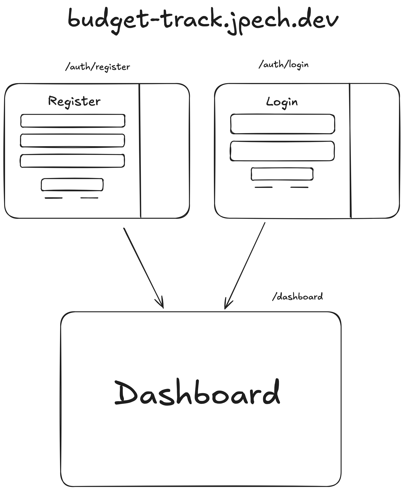
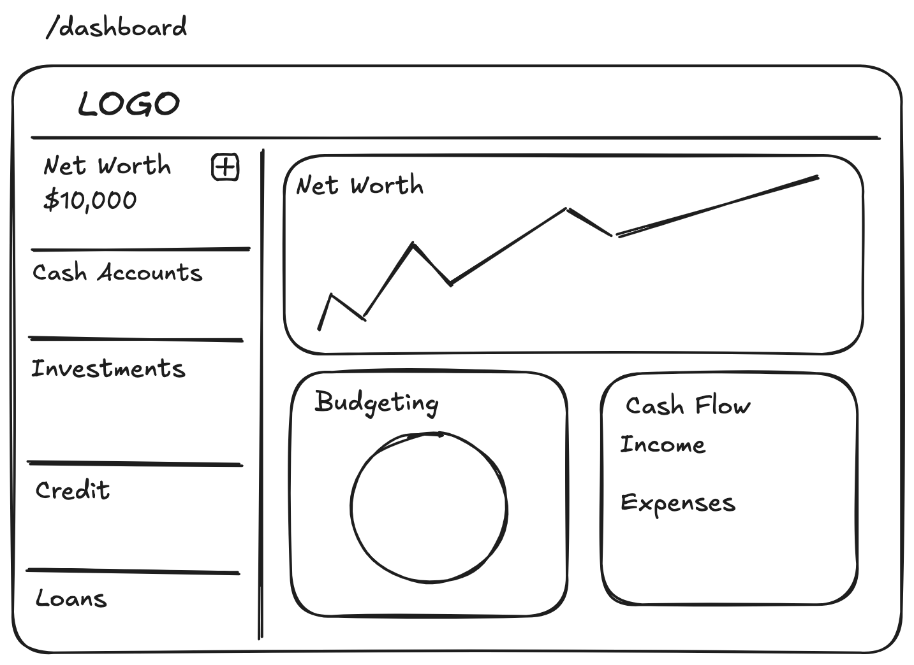

# Application Design

## Authentication

First the user should be able to Log in or register this will take them to 
the dashboard page where they can interact with the application

In the future there wil be a guest button here that will let users try the app without registering

## Dashboard

The main dashboard is inspired in other budgeting applications, it will be build by parts and contain useful information

